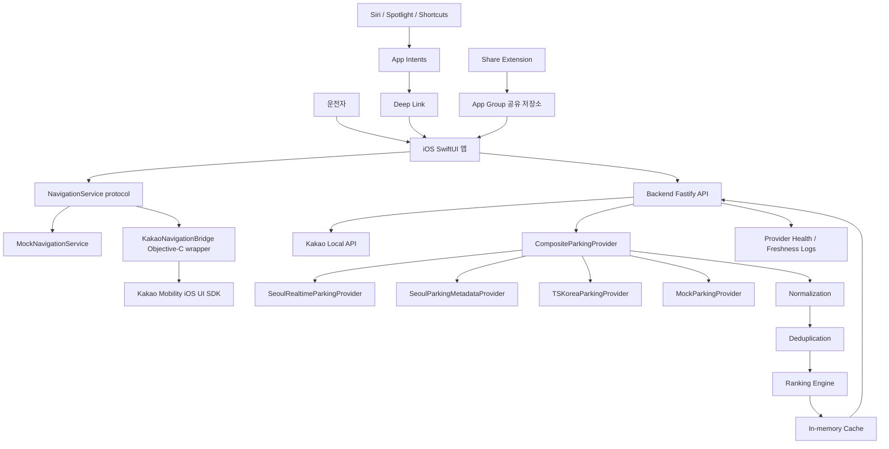

# 서울 목적지 주변 주차 추천 + 실시간 주차 정보 + 인앱 내비게이션 Production Candidate 계획

## 1. 의사결정 메모

### 1. 왜 오버레이 방식은 iOS 실서비스 경로로 부적합한가
- 외부 내비 앱 위에 UI를 띄우거나 다른 앱의 화면을 읽는 구조는 iOS 샌드박스, 개인정보, App Store 심사 관점에서 위험하다.
- Kakao Navi 또는 다른 내비 앱의 검색 흐름에 주차 정보를 끼워 넣는 방식은 공식 확장 지점이 아니며, 유지보수성과 승인 가능성이 낮다.
- 따라서 A안 “외부 내비 앱 위 오버레이”는 제외한다.

### 2. 왜 인앱 내비게이션 방식이 이번 프로젝트의 우선 해법인가
- C안 “검색 → 주차 추천 → 상세 → 인앱 길안내”가 사용자 마찰을 가장 낮추고, 데이터 출처·freshness·fallback을 한 화면 흐름 안에서 통제할 수 있다.
- Kakao Mobility의 iOS 길찾기 UI SDK는 Objective-C 기반이며 iOS 15 이상 요구 사항이 있으므로 SwiftUI 앱에서 bridge 계층으로 감싼다.
- 단, SDK 계약/승인/상용 사용 조건이 blocker가 되면 B안 “앱에서 주차장 선택 후 외부 내비로 fallback”을 숨겨진 운영 플래그로 준비하되, MVP 기본 UX는 C안으로 유지한다.

### 3. App Intents가 검색 마찰을 어떻게 줄이는가
- `목적지 주변 주차 찾기` intent는 Siri, Spotlight, Shortcuts에서 목적지 문자열을 받아 앱의 목적지 확인 화면으로 deep link한다.
- `최근 목적지로 길안내 시작` intent는 최근 목적지 entity를 선택해 바로 주차 추천 또는 길안내 진입으로 연결한다.
- intent 내부에는 네트워크/검색 로직을 직접 넣지 않고, 앱과 공유하는 `DestinationRoutingService`와 deep link handoff만 둔다.

### 4. Share Extension이 주소 전달 마찰을 어떻게 줄이는가
- Safari, Messages, Maps 등에서 공유된 plain text/URL을 extension이 수신한다.
- 수신값은 `SharedDestinationDraft`로 App Group `UserDefaults`에 저장하고, custom URL scheme 또는 universal link로 메인 앱의 목적지 확인 화면을 연다.
- extension은 민감한 API 키를 갖지 않으며, 실제 geocoding은 메인 앱 또는 백엔드를 통해 수행한다.

### 5. 서울 주차 실시간 데이터 연동 방법
- `SeoulRealtimeParkingProvider`는 서울시 시영주차장 실시간 주차대수 데이터 provider로 둔다.
- 서울 열린데이터광장 데이터는 “실제 데이터와 5분 이상 차이가 날 수 있음”을 전제로 freshness와 stale 경고를 UI에 노출한다.
- `SeoulParkingMetadataProvider`는 서울시 공영주차장 안내 정보를 총면수, 운영시간, 요금, 주소 보강용으로 사용한다.

### 6. data.go.kr / 한국교통안전공단 주차 API 연동 방법
- `TSKoreaParkingProvider`는 한국교통안전공단 주차정보 API를 감싼다.
- 이 API는 시설정보 대비 운영정보/실시간 주차정보 수가 적다는 한계가 있으므로 provider quality score에 반영한다.
- 개발계정/운영계정 전환은 `PUBLIC_DATA_SERVICE_KEY`, `PUBLIC_DATA_ENV`, `PUBLIC_DATA_BASE_URL` 환경 변수로 분리한다.

### 7. 실시간 데이터 커버리지 한계와 fallback 전략
- `availableSpaces + totalCapacity`가 있으면 `occupancyRate`를 계산한다.
- `availableSpaces`만 있으면 가능 대수만 표시하고 점유율은 `null`로 둔다.
- `congestionStatus`만 있으면 혼잡도 태그를 표시한다.
- 실시간 필드가 없으면 `실시간 정보 없음`, freshness가 오래되면 `업데이트 지연 가능` 배지를 표시한다.
- stale 데이터는 “실시간”으로 표시하지 않는다.

### 8. API 키 보안 모델
- Kakao Local REST key, 서울 열린데이터광장 key, data.go.kr key는 백엔드 `.env`에만 둔다.
- iOS에는 `API_BASE_URL`, Kakao Native App Key처럼 SDK 초기화에 필요한 공개성 설정만 `xcconfig`로 둔다.
- `.env`, 운영 `xcconfig`, signing 파일은 커밋하지 않고 example 파일과 문서만 제공한다.

### 9. TestFlight 및 App Store 제출을 고려한 구조
- iOS target은 `App`, `AppIntents`, `ShareExtension`으로 분리하고 App Group entitlement를 문서화한다.
- 개인정보 문서에는 위치 권한 사용 목적, 공유 텍스트 처리, 로그 수집 범위, 외부 API 데이터 출처를 명시한다.
- release 문서에는 signing, bundle id, provisioning profile, TestFlight preflight, App Store metadata checklist를 포함한다.

### 10. MVP와 실서비스 후보의 차이
- MVP는 mock 흐름 위주지만, 실서비스 후보는 provider adapter, env 분리, health endpoint, stale 보호, 테스트, 운영 runbook, 배포 체크리스트까지 포함한다.
- mock provider는 기본값으로 동작하되, 실제 키를 넣으면 Kakao Local/서울/data.go.kr provider로 전환 가능해야 한다.

### 11. 현재 단계에서 반드시 사람이 직접 해야 하는 일
- Kakao Developers 앱 등록, Kakao Local 및 Native App Key 확인.
- Kakao Mobility 길찾기 UI SDK 사용 권한/계약/라이선스 확인.
- 서울 열린데이터광장 인증키 발급.
- data.go.kr 한국교통안전공단 API 활용 신청 및 운영 전환 승인.
- Apple Developer Team, bundle id, App Group, signing/provisioning 설정.

## 2. 전체 시스템 아키텍처 다이어그램



## 3. 레포 구조 트리

```text
project-root/
  ios-app/
    project.yml
    App/
    Core/Models/
    Core/Networking/
    Core/DesignSystem/
    Core/Configuration/
    Core/Storage/
    Core/Logging/
    Features/Search/
    Features/ParkingResults/
    Features/ParkingDetail/
    Features/Navigation/
    Features/Recents/
    Features/Favorites/
    Features/Settings/
    Integrations/AppIntents/
    Integrations/ShareExtension/
    Integrations/NavigationBridge/
    Integrations/DeepLinks/
    Resources/
    Config/
    Tests/
  backend/
    package.json
    tsconfig.json
    vitest.config.ts
    src/app/
    src/routes/
    src/providers/
    src/services/
    src/ranking/
    src/normalization/
    src/deduplication/
    src/cache/
    src/config/
    src/health/
    src/logging/
    src/middleware/
    src/types/
    tests/
    scripts/
  shared-types/
    package.json
    src/
  docs/
    architecture/
    operations/
    privacy/
    release/
    api/
  package.json
  pnpm-workspace.yaml
  README.md
  .env.example
  .env.production.example
```

## 4. 실제 생성할 파일 목록

- 루트: `package.json`, `pnpm-workspace.yaml`, `.env.example`, `.env.production.example`, `README.md`
- 문서: `docs/architecture/decision-memo.md`, `docs/architecture/system-diagram.md`, `docs/api/backend-api.md`, `docs/operations/provider-health.md`, `docs/operations/runbook.md`, `docs/privacy/privacy-template.md`, `docs/release/testflight-checklist.md`, `docs/release/appstore-checklist.md`, `docs/release/signing-placeholders.md`
- shared-types: `src/parking.ts`, `src/destination.ts`, `src/api.ts`, `src/index.ts`
- backend: Fastify app, routes, config, providers, normalization, deduplication, ranking, cache, health, scripts, Vitest 테스트
- iOS: SwiftUI app shell, search/results/detail/navigation/settings/recents/favorites 화면, networking/storage/logging/config, App Intents, Share Extension, DeepLinks, NavigationBridge Objective-C/Swift 파일, mock services, XCTest skeleton

## 5. 각 주요 파일의 전체 내용 생성 방침

- 구현 단계에서는 위 파일을 실제로 생성한다.
- 문서와 TODO는 모두 한국어로 작성한다.
- 코드 식별자는 Swift/TypeScript 관례를 따른다.
- iOS 프로젝트는 `XcodeGen project.yml` 기반으로 생성한다. 이유는 `.xcodeproj`를 수작업으로 생성하는 것보다 재현 가능하고, App target/AppIntents target/ShareExtension target/entitlements를 명확히 관리할 수 있기 때문이다.
- iOS 최소 버전은 `iOS 16.0`으로 둔다. Kakao Mobility UI SDK 요구 iOS 15 이상과 App Intents 요구 사항을 함께 만족한다.
- SwiftUI 상태 관리는 iOS 16 호환성을 위해 `ObservableObject`, `@StateObject`, `@ObservedObject`를 사용한다.
- 백엔드는 `Fastify + TypeScript + Zod + Vitest + pino`로 구현한다.
- 패키지 관리는 `pnpm workspace`로 통일한다.

## 6. 로컬 실행 방법

- `pnpm install`
- `pnpm --filter @parking/backend dev`
- `pnpm --filter @parking/backend test`
- `pnpm --filter @parking/backend preflight`
- iOS는 `brew install xcodegen` 후 `cd ios-app && xcodegen generate`, Xcode에서 `ParkingLotNavigator.xcodeproj` 실행
- 기본 provider는 mock이므로 API 키 없이 검색 → 결과 → 상세 → mock 길안내 흐름이 동작한다.

## 7. 실제 API 키 연결 방법

- 백엔드 `.env`:
  - `KAKAO_REST_API_KEY`
  - `SEOUL_OPEN_DATA_KEY`
  - `PUBLIC_DATA_SERVICE_KEY`
  - `PARKING_PROVIDER_MODE=mock|real|hybrid`
  - `STALE_THRESHOLD_SECONDS=600`
- iOS `Config/Debug.xcconfig`, `Config/Release.xcconfig`:
  - `API_BASE_URL`
  - `KAKAO_NATIVE_APP_KEY`
  - `APP_GROUP_ID`
- Kakao Local은 백엔드 `/search/destination`에서만 호출한다.
- 서울/data.go.kr provider는 백엔드 `/parking/nearby` 내부 composite provider에서 호출한다.
- 참고 공식 문서:
  - [Kakao Local API](https://developers.kakao.com/docs/latest/ko/local/dev-guide)
  - [Kakao Mobility iOS 길찾기 UI SDK](https://developers.kakaomobility.com/docs/ios-ui/)
  - [서울시 시영주차장 실시간 주차대수 정보](https://data.seoul.go.kr/dataList/OA-21709/A/1/datasetView.do)
  - [서울시 공영주차장 안내 정보](https://data.seoul.go.kr/dataList/OA-13122/S/1/datasetView.do)
  - [한국교통안전공단 주차정보 제공 API](https://www.data.go.kr/data/15099883/openapi.do)

## 8. TestFlight 전 점검 방법

- `pnpm --filter @parking/backend test` 통과
- `pnpm --filter @parking/backend preflight`로 env 누락, provider health, stale 설정 확인
- Xcode에서 Debug/Release build 통과
- 실제 기기에서 위치 권한, Share Extension, App Intent deep link, App Group 전달 확인
- Kakao Mobility SDK 미설치/초기화 실패 시 mock 또는 안내 화면 fallback 확인
- 개인정보 문구, 위치 권한 문구, 데이터 출처 표시 확인

## 9. App Store 제출 준비 체크리스트

- Bundle ID, App Group, Associated Domains, signing/provisioning 확정
- 위치 권한 사용 목적 문구 한국어/영어 준비
- 공유 확장 설명, 개인정보 처리방침 URL 준비
- 외부 데이터 출처와 실시간 정보 한계 고지
- Kakao Mobility SDK 라이선스 및 상용 사용 승인 확인
- 앱 심사용 데모 계정 또는 mock/demo mode 제공
- crash logging, backend structured logging, provider health 확인 경로 문서화

## 10. 다음 구현 우선순위

1. 문서와 설정 파일 생성: decision memo, README, env examples, release/privacy 문서.
2. shared-types 생성: destination, parking lot, provider health, API response DTO.
3. backend 생성: Fastify app, mock provider, normalization, deduplication, ranking, cache, health, tests.
4. iOS 생성: XcodeGen 프로젝트, SwiftUI 화면 흐름, mock API client, local storage, stale/unknown UI.
5. NavigationBridge 생성: `NavigationService`, `MockNavigationService`, Objective-C wrapper, Swift adapter, SDK 미설치 fallback.
6. App Intents 생성: 목적지 주변 주차 찾기, 최근 목적지 길안내, App Shortcuts provider.
7. Share Extension 생성: text/URL 수신, App Group 저장, deep link handoff.
8. 실연동 준비: Kakao Local provider 활성화, Seoul/data.go.kr provider skeleton에 실제 URL/env 연결.
9. 품질 보강: XCTest smoke test, Vitest integration test, preflight/release scripts.
10. TestFlight 준비: signing 문서 확정, 실제 기기 시나리오 점검, App Store 체크리스트 완료.

## 명시적 기본값

- 아키텍처 선택: C안 full in-app 방식.
- fallback: Kakao Mobility SDK 사용 불가 시에만 B안 external navigation handoff를 운영 플래그로 제한 제공.
- 백엔드 프레임워크: Fastify.
- 패키지 매니저: pnpm workspace.
- iOS 프로젝트 생성: XcodeGen.
- iOS 최소 버전: 16.0.
- 기본 실행 모드: mock provider.
- stale 기준 기본값: 10분.
- 주차장 검색 반경 기본값: 800m, 설정으로 500m~1000m 조정 가능.
- 랭킹 가중치 위치: backend `src/ranking/rankingConfig.ts`.
- 민감 키 저장 위치: 백엔드 env 또는 로컬 비커밋 설정 파일, 클라이언트 하드코딩 금지.
## 2026-04-29 direction update: destination companion flow

### Final user flow first

1. User chooses a destination or place.
2. The app keeps the current plan: nearby parking recommendations and optional realtime parking layer.
3. User turns on the `Lodging` map toggle beside realtime parking, festivals, and events.
4. Lodging pins render in the same map-layer style as festivals and events.
5. The bottom discovery list shows lodging, festivals, and events together with search and sorting.
6. Lodging detail shows real lodging metadata first; booking-platform prices appear only when an OTA provider is approved.
7. Opening a lodging item on the map recenters the app on that lodging and reloads nearby parking/realtime context.

### Preserve the current plan

- Keep the core `destination search -> parking recommendations -> detail/navigation` flow intact.
- Treat lodging, festivals, events, and realtime parking as additive layers, not replacements for parking.
- Keep lodging provider keys and any future price-fetching logic on the backend provider layer.
- Use Korea Tourism Organization TourAPI lodging data as the first real lodging provider, with Kakao Local accommodation category search as fallback.
- Before adding booking integrations, confirm API/affiliate terms, rate limits, caching rules, price freshness, and tax/fee display requirements.

### Lodging comparison phase 1

- `LodgingOption`: name, type, address, coordinate, distance, rating, image, optional lowest price text, optional lowest-price platform, amenities.
- `LodgingPlatformOffer`: platform, price text, numeric price, currency, booking URL, refundable flag, tax/fee inclusion flag. Public domestic providers usually return no offers.
- iOS: add a `Lodging` toggle next to realtime/festival/event toggles.
- iOS: expand the event/festival discovery list to include lodging in the same row/detail pattern.
- Backend: `/discover/lodging` uses server-side provider adapters. Phase 1 uses TourAPI lodging (`contentTypeId=32`) and Kakao Local lodging (`AD5`); Expedia, Booking, Agoda, HotelsCombined, or Trip.com can be layered later where terms allow.
