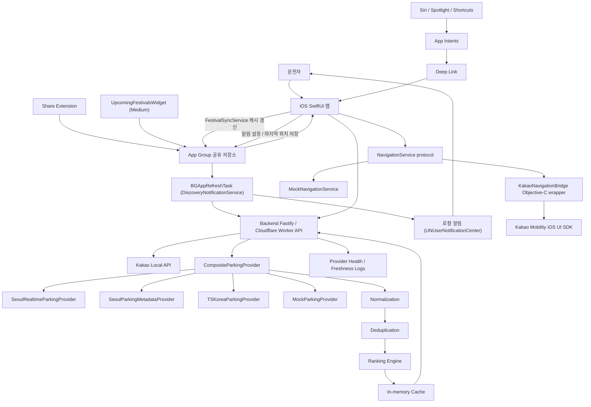

# 전체 시스템 아키텍처

`App Group 공유 저장소` (`group.com.sangminbis9.ParkingLotNavigator`) 는 세 iOS target 이 공유한다:

- Main app: `FestivalSyncService` 가 `/api/festivals?upcomingWithinDays=90` 결과를 필터 적용 후 `widget_festivals.json` 으로 저장하고 `WidgetCenter.shared.reloadTimelines` 호출.
- ShareExtension: 공유받은 주소/URL 을 임시 목적지 후보로 저장.
- UpcomingFestivalsWidget: `widget_festivals.json` 캐시만 읽고 timeline 갱신 (네트워크 직접 호출 없음).
- Main app: 알림 설정(`notificationPreferences`)과 마지막 알려진 좌표(`lastKnownLocation.*`)를 저장한다. `DiscoveryNotificationService` 가 `BGAppRefreshTask` 로 깨어나 이 값을 읽어 관심 조건(카테고리/지역/반경)에 맞는 새 축제·로컬 이벤트를 Worker API 에서 조회하고, 신규 항목이 있으면 `UNUserNotificationCenter` 로 도메인별 요약 로컬 알림을 보낸다. 서버 푸시(APNs)는 사용하지 않는다 (best-effort, iOS 가 실행 시점 결정).
