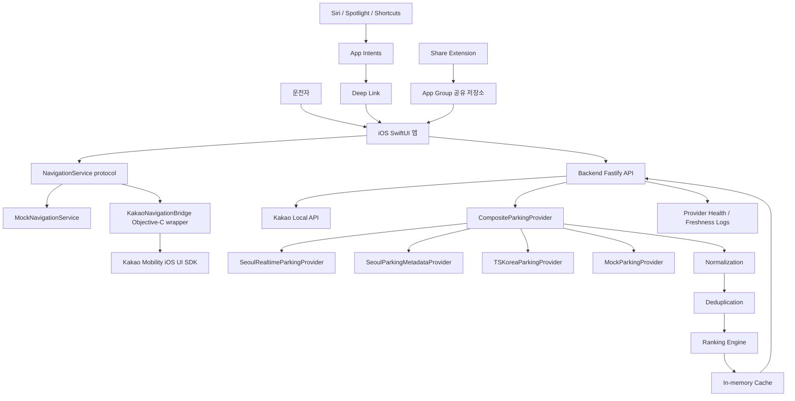

# 전체 시스템 아키텍처

```mermaid
flowchart TD
  User["운전자"] --> IOS["iOS SwiftUI 앱"]
  Siri["Siri / Spotlight / Shortcuts"] --> Intents["App Intents"]
  Share["Share Extension"] --> SharedStore["App Group 공유 저장소"]
  DeepLink["Deep Link"] --> IOS

  Intents --> DeepLink
  SharedStore --> IOS

  IOS --> API["Backend Fastify API"]
  IOS --> NavService["NavigationService protocol"]
  NavService --> MockNav["MockNavigationService"]
  NavService --> KakaoBridge["KakaoNavigationBridge Objective-C wrapper"]
  KakaoBridge --> KakaoNav["Kakao Mobility iOS UI SDK"]

  API --> KakaoLocal["Kakao Local API"]
  API --> Composite["CompositeParkingProvider"]
  Composite --> SeoulRT["SeoulRealtimeParkingProvider"]
  Composite --> SeoulMeta["SeoulParkingMetadataProvider"]
  Composite --> TS["TSKoreaParkingProvider"]
  Composite --> Mock["MockParkingProvider"]

  Composite --> Normalize["Normalization"]
  Normalize --> Dedup["Deduplication"]
  Dedup --> Rank["Ranking Engine"]
  Rank --> Cache["In-memory Cache"]
  Cache --> API

  API --> Health["Provider Health / Freshness Logs"]
```
