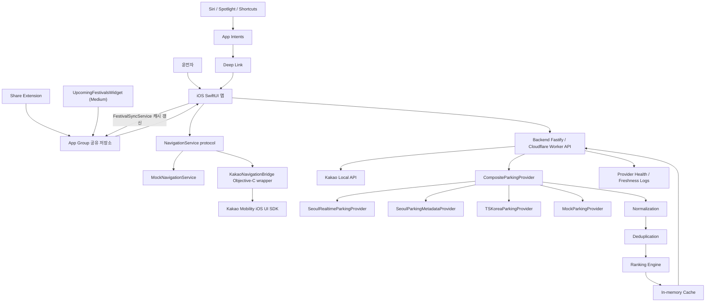

# 전체 시스템 아키텍처

`App Group 공유 저장소` (`group.com.sangminbis9.ParkingLotNavigator`) 는 세 iOS target 이 공유한다:

- Main app: `FestivalSyncService` 가 `/api/festivals?upcomingWithinDays=90` 결과를 필터 적용 후 `widget_festivals.json` 으로 저장하고 `WidgetCenter.shared.reloadTimelines` 호출.
- ShareExtension: 공유받은 주소/URL 을 임시 목적지 후보로 저장.
- UpcomingFestivalsWidget: `widget_festivals.json` 캐시만 읽고 timeline 갱신 (네트워크 직접 호출 없음).
